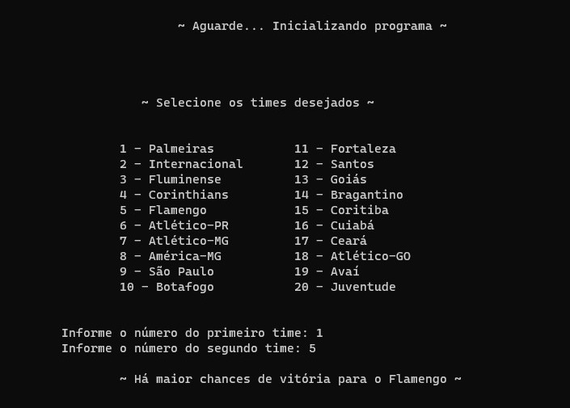
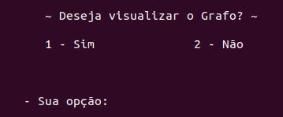
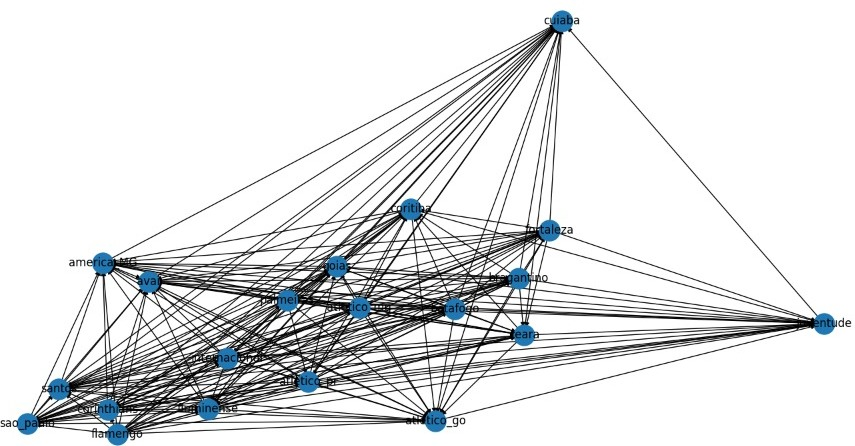

<h1 align = "center">
  Previsões utilizando Grafos
</h1>

Este repositório contém a implementação de uma forma primitiva e amadora de realizar previsões sobre qual time sairia vencedor em uma partida de futebol, envolvendo todos os times presentes na série A.

<h2 align = "center">
    ⚠️
    <strong>
        <em> Problemática </em>
    </strong> 
</h2>

Sabe-se que no futebol, uma das grandes indústrias que crescem é voltada para o mercado de apostas, sendo uma fonte consideravelmente forte de renda extra. Entretanto, enquanto humanos, é comum desconsiderar alguns fatores essenciais ao realizar uma aposta por puro esquecimento de estatística X ou Y. Pensando nisso, o programa foi criado como uma forma de juntar todas as estatísticas importantes para o processo de decisão para um resultado, apresentando uma previsão decidida por meio da análise de todas as informações coletadas por meio de sites voltados ao mundo futibolístico.

<h2 align = "center">
    ⚙️
    <strong>
        <em>Tecnologias utilizadas</em>
    </strong>
</h2>

<table align="center">
  <tr>
    <td><strong>Tecnologia</strong></td>
    <td><strong>Versão</strong></td>
  </tr>
  <tr>
    <td>Python</td>
    <td>3.10.6</td>
  </tr>
  <tr>
    <td>pandas</td>
    <td>1.5.1</td>
  </tr>
  <tr>
    <td>numpy</td>
    <td>1.23.4</td>
  </tr>
  <tr>
    <td>requests</td>
    <td>2.28.1</td>
  </tr>
  <tr>
    <td>lxml</td>
    <td>4.9.1</td>
  </tr>
  <tr>
    <td>openpyxl</td>
    <td>3.0.10</td>
  </tr>
  <tr>
    <td>networkx</td>
    <td>2.8.8</td>
  </tr>
  <tr>
    <td>matplotlib</td>
    <td>3.6.2</td>
  </tr>
</table>


<h2 align = "center">
    🔬
    <strong>
        <em>Dados levados em consideração</em>
    </strong>
</h2>

Essa é a versão inicial de um projeto que possívelmente pode ter sequência, sendo assim, o programa conta com apenas um tipo de dado levado em consideração:
- Colocações nos 5 anos anteriores da competição.

É plausível ainda salientar que houve o desejo de adicionar o mérito do confronto direto entre ambos os times que estariam em duelo, entretanto, a fonte encontrada para a desejada informação não aceitava a quantidade de requisições necessárias pelo programa. Ao entrar em contato com o site em questão, solicitando uma liberação ou se havia a existência de uma API, não houve retorno.

<h2 align="center"> 
   💡<strong>
        <em>Algoritmo </em>
    </strong>
</h2>

<d1>
    <dt> 1. Realizar a coleta de informações desejadas por meio de Web Scraping; </dt>
    <dt> 2. Salvar as informações no programa para uso posterior; </dt>
    <dt> 3. Aplicar a aritmética considerada eficiente aos dados coletados; </dt>
    <dt> 4. Utilizar grafos a fim de organizar as informações da forma desejada; </dt>
    <dt> 5. Solicitar ao usuário que informe qual será o confronto; </dt>
    <dt> 6. Informar ao usuário qual o time que <strong>PROVAVELMENTE</strong> vencerá o confronto, utilizando os dados já armazenados no programa. </dt>
</d1>

<h2 align="center"> 
   🖥️<strong>
        <em>Implementação</em>
    </strong>
</h2>

Inicialmente, seguindo o que foi pontuado no detalhamento do algoritmo, o primeiro passo foi realizar a coleta de informações. Para esse estágio, foram utilizadas as bibliotecas **pandas**, **requests**, **openpyxl** e **lxml**, sendo cada uma delas extremamente importante para cada fase dessa coleta:
- **Pandas** será utilizado a fim de trabalhar com todo o conteúdo HTML em dataframes;
- **Requests** foi utilizado como uma forma segura de realizar as requisições para o Web Scraping a fim de minimizar as chances de erros;
- **Openpyxl** e **lxml** serviu o propósito de salvar todos os dados coletados, após serem tratados, em arquivos **.xlsx**.

Todo esse processo é feito dentro da função **_webScraping_Position(x)_** e, inicialmente, é estruturado um dicionário com o nome **ids_times()**, responsável por associar o time que se deseja realizar a pesquisa com sua identificação única no site, que será chamado na variável **url_link**, a qual receberá o endereço padrão do site, com o final sendo a parte que difere cada time e, para realizá-la, é chamado a posição **x** do dicionário (nome do time, parâmetro da função em pauta), que concatenará o ID ao restante do link.

Na sequência é feita a requisição no site que se deseja obter os dados e assim, todo o conteúdo HTML é transferido para uma variável auxiliar, sendo um array de dataframes, divididos pelas tabelas. Em seguida, a tabela correta é transferida para uma variável que será utilizada para realizar o tratamento dos dados. O tratamento foi pensado visando obter somente as informações necessárias, além da identificação da temporada e da pontuação, apenas por questão de controle e organização, ao salvar os dados no arquivo .xlsx. Sendo assim, foram selecionados três colunas, que foram posteriormente renomeadas para melhor visualização, sendo elas a **Temporada**, **Pontos** e **Colocação**, sendo a colocação a que de fato seria utilizada. Por fim, os dados são salvos no arquivo, assim como anteriormente citado, e a função tem como retorno a chamada para uma outra função, **_arithmeticsPositionAverage(var)_**, a qual será responsável por realizar a aritmética desejada utilizando os dados obtidos. A função de retorno será explicada em seguida, logo após a apresentação do código que acabara de ser mencionado.

```python
def webScraping_position(x):
	ids_times = {'palmeiras': '1023', 'internacional': '6600', 'fluminense': '2462', 'corinthians': '199', 'flamengo': '614', 'atletico_pr': '679', 'atletico_mg': '330', 
	'america_MG': '2863', 'sao_paulo': '585', 'botafogo': '537','fortaleza': '10870', 'santos': '221', 'goias': '3197', 'bragantino': '8793', 'coritiba': '776', 
	'cuiaba': '28022', 'ceara': '2029', 'atletico_go': '15172', 'avai': '2035', 'juventude': '10492'}

	header = {
		"User-Agent": "Mozilla/5.0 (X11; Linux x86_64) AppleWebKit/537.36 (KHTML, like Gecko) Chrome/50.0.2661.75 Safari/537.36",
		"X-Requested-With": "XMLHttpRequest"
	}

	url_link = "https://www.transfermarkt.com.br/standart-team/platzierungen/verein/" + ids_times[x]

	req = requests.get(url_link, headers = header)
	df = pd.read_html(req.text)
	stats = df[1].copy()
	stats = stats[['Temporada', 'Pontos', 'Liga.2']]
	stats = stats.rename(columns={'Temporada': 'Temporada', 'Pontos': 'Colocação', 'Liga.2': 'Divisão'})
	stats.to_excel("position/" + x + ".xlsx")

	return (arithmeticsPositionAverage(stats))
```

Tendo os dados sido coletados, parte ao ponto de realizar as operações com as informações de forma que elas sejam condizentes com a realidade atual, haja visto que os dados voltam são coletados sobre os últimos 5 anos. A forma encontrada para manter os dados mais realistas possíveis foi por meio de uma média ponderada, juntamente a algumas outras exceções que foram tratadas como forma de manter a integridade do programa:

Basicamente, foram dados pesos regressivos à medida que os anos passaram, quanto mais atual, maior o peso da colocação, baseado em quantos dados se tem de um determinado time. Após as coletas de dados, foi realizado um teste envolvendo todos os times que seriam analisados, a fim de visualizar qual o dado mais antigo que se tem para cada um. Mediante a tal análise, foi possível ter a certeza de que o time com mais dados tinha 17 colocações passadas. Ademais, foi possível perceber que determinados times não possuiam essa mesma quantidade devido ao fator de não estarem entre as principais ligas do Campeonato Brasileiro, sendo elas Série A e Série B, jogando ainda as classificatórias, as quais não foram abordadas pelo site. Devido à essa situação, para os times que não possuiam essa mesma quantidade de dados, foi atribuido a colocação 20º, assumindo que o time ficaria na última colocação, devido à grande discrepância (Série A vs Série C+). Ainda é plausível salientar que, para os times com colocações na segunda divisão, foi atribuída a colocação 16º, desconsiderando a colocação obtida na série B, como uma forma de, novamente, parear para como se estivessem jogando na primeira divisão do futebol brasileiro. Por fim, aritmética seguiu a seguinte regra, se estendendo até o ano de 2005:

<table align="center">
  <tr>
    <td><strong>Temporada</strong></td>
    <td><strong>Peso</strong></td>
  </tr>
  <tr>
    <td>2021</td>
    <td>1</td>
  </tr>
  <tr>
    <td>2020</td>
    <td>16/17</td>
  </tr>
  <tr>
    <td>2019</td>
    <td>15/17</td>
  </tr>
  <tr>
    <td>2018</td>
    <td>14/17</td>
  </tr>
  <tr>
    <td>2017</td>
    <td>13/17</td>
  </tr>
</table>

Agora, partindo para como foi para, de fato, implementar a ideia, inicialmente foi utilizada uma variável para salvar qual era o último index válido, haja visto que ele representaria a quantidade de anos em que os valores foram coletados. Portanto, a variável **boundary** recebeu o valor de **_stats.last_valid_index() + 1_**, sendo stats o dataframe obtido a partir da função mencionada anteriormente. O motivo do +1 ao final é devido ao index começar de 0, e deseja-se iniciar a contagem assim como se realiza fora do âmbito da programação (começando de 1), a fim de obter mais controle. Na sequência, essa variável passa por uma condicional e, caso a mesma seja diferente de 17 (não tenha dados de todos os anos), terá um tratamento diferente em situação posterior.

Seguindo, chega ao ponto que é estruturado o denominador, sendo ele o somatório de todos os pesos utilizados para o numerador. Para tal, é utilizado um looping **for** simples, num range que vai de 1 a 18, fazendo com que o denominador seja igual a ele mesmo somado a $\frac{j}{17}$, que vai sendo iterado até chegar ao peso final 1. 

Tendo o valor do denominador, resta somente obter o valor do numerador e, a fim de seguir o que foi supracitado sobre as colocações e divisões, foi utilizada a variável **lvi** que tem valor inicial igual a 17, que será decrementada a media que as temporadas forem passando, a fim de seguir o que foi visualizado na tabela acima, além de três condicionais que foram utilizadas dentro de um looping **for**, num range que vai de 0 a 17 para a variável "i", buscando aplicar a média ponderada e obter, finalmente a "classificação geral" do time:

- Caso "i" seja menor que **boundary** e a "divisão" seja diferente de "Segunda Divisão", significa que há dados sobre o time na primeira divisão no determinado ano e assim
  - Numerador será igual a ele mesmo somado a $colocacao * \frac{lvi}{17}$;
- Caso "i" seja menor que **boundary** e a "divisão" seja igual a "Segunda Divisão", significa que há dados sobre o time na segunda divisão no determinado ano e assim
  - Numerador será igual a ele mesmo somado a $\frac{16 * lvi}{17}$;
- Caso "i" seja maior ou igual a **boundary**, significa que não há dados sobre o time seja na primeira ou segunda divisão no determinado ano, e assim
  - Numerador será igual a ele mesmo somado a $\frac{20 * lvi}{17}$;


Ainda há de salientar que, ao final de cada iteração, **lvi** é decrementado em 1. Por fim, a função retorna o valor de $\frac{numerador}{denumerador}$ para onde a função foi chamada. Veja abaixo como a função foi implementada:

```python
def arithmeticsPositionAverage(stats):
	boundary = stats.last_valid_index() + 1
	lvi = 17

	numerator = 0
	j = 1
	denominator = 0

	for j in range(18):
		denominator = denominator + (j/17)

	for i in range(17):
		if i < (boundary) and stats['Divisão'].iloc[i] != "Segunda Divisão":
			numerator = numerator + (stats['Colocação'].iloc[i] * (lvi / 17))
		elif i < (boundary) and stats['Divisão'].iloc[i] == "Segunda Divisão":
			numerator = numerator + (16 * (lvi / 17))
		elif i >= boundary:
			numerator = numerator + (20 * (lvi / 17))

		lvi = lvi - 1

	return (numerator/denominator)
```

Agora chega ao ponto onde tudo é comutado a fim de que o programa de fato aconteça. Na "main", existem dois dicionários, sendo um deles voltado para enviar a funções os exatos nomes utilizados para obter o ID correto dos times após serem digitados por meio do Menu, sendo ele o **team_codes**, junto ao **team_output_names**, utilizado com o propósito de, a partir da seleção no Menu, ser capaz de usar o nome do time como output de uma forma mais agradável visualmente, além de condizente com o português escrito. Aliado a isso, há uma lista com o nome de todos os times escritos assim como no primeiro dicionário, a fim de passar também para a função com a correta gramática para encontrar a página correta do time durante o Web Scraping, com o nome de **graph_names**.

Para o início da implementação, ainda é desginado um novo dicionário, entretanto ainda vazio, com o nomve de **average_positions**. Com tudo isso sendo dito, é iniciado um looping **for**, que itera por todos os elementos da lista supracitada, chamando a função para fazer o Web Scraping para cada "i", sendo ele o nome dos times, utilizando o próprio nome como a chave para o dicionáiro acima, sendo o valor da chave, a média encontrada pelo programa.

A esse ponto, vêm a necessidade de explicar como os **Grafos** serão usados para essa aplicação:
  - Cada time será um vértice, e eles serão ligados de forma que, caso o time A tenha uma média **MENOR** do que a média do time B, uma aresta "sairá" de A e "entrará" em B, indicando que A tem maior probabilidade de ganhar a partida do que B.
  - Todos os times serão comparados com todos,, mesmo que nem todos eles sejam usados, de forma que, uma vez que o programa esteja pronto para uso, todas as ações tomadas dentro do mesmo sejam instantâneas.

É criado um grafo direcionado, utilizando a biblioteca **_networkx_** e nele são adicionados todos os nós desejados, sendo eles os times utilizados e presentes na lista **graph_names** (inclusive esse é o motivo da mesma ter esse nome). Em sequência, é utilizado o método da bolha, a fim de comparar todos os valores entre si. Nele, é utilizado as informações do **average_positions**, e visualizado se a média do time em **average_positions**, com a chave **graph_names** em **i**, é maior que o mesmo direcionamento, porém trocando **i** por **j**:
  - Caso seja, será adicionado uma aresta, saindo do vértice **graph_names[i]** para **graph_names[j]**;
  - Caso contrário, sairá de **graph_names[j]** para **graph_names[i]**.

Com as informações todas salvas, um menu será inserido na tela do usuário, dando opções de times para escolher e realizar as comparações, além de um adendo para caso dseje sair do programa, sendo necessário apenas digitar o número para time igual, tanto no primeiro, quanto no segundo.

Após esse processo, caso seja de desejo do usuário visualizar o Grafo, o programa perguntará, bastando digitar **1** quando solicitado, se não, digitando **2**, será finalizado sem o display.

<h2 align="center">
    🖨️ <strong>
        <em>Exemplo de Execução</em>
    </strong>
</h2>

Após executar corretamente o programa, o que se deve esperar é um menu como esse, contando com dois inputs por conta do usuário e, logo em seguida, o resultado para o confronto em questão:

<p align="center">
     
</p>

Ao finalizar a execução do looping, o menu abaixo será disponibilizado ao usuário:

<p align="center">
     
</p>

E caso a opção selecionada seja a primeira, um grafo desse padrão será gerado para posterior visualização do usuário:

<p align="center">
     
</p>

<h2 align="center">
    🔧
    <strong>
        <em> 
            Execução
        </em>    
    </strong>
</h2>

Inicialmente, verifique se todas as bibliotecas estão coerentes com as apresentadas no tópico Tecnologias Utilizadas, abra o console na pasta do repositório e siga com o comando:
<p align="center"> <strong> python3 main.py</strong></p>